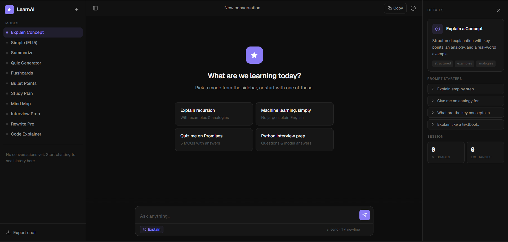
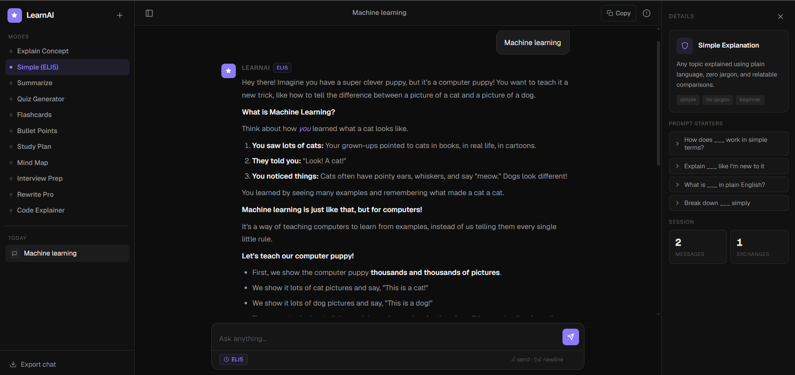

# LearnAI

## Application Preview

### Home Interface



### AI Response Example



## Overview

LearnAI is a web-based AI assistant that enables users to interact with a Large Language Model through a simple and intuitive interface. Users can submit natural language queries, which are processed by the Google Gemini API via a Node.js backend, and receive AI-generated responses in real time.

This project was developed as part of **Task 1: Build Your First AI Tool**, demonstrating the integration of an LLM API into a full-stack web application.

---

## Live Demo

**Application:**
https://learnai-hchs.onrender.com

**Source Code:**
https://github.com/RutujN/LearnAI

---

## Features

* Accepts user text input through a web interface
* Sends prompts to the Google Gemini API
* Displays AI-generated responses in real time
* Secure API key management using environment variables
* Cloud deployment using Render
* Responsive and lightweight design

---

## Technology Stack

### Frontend

* HTML5
* CSS3
* JavaScript (ES6)

### Backend

* Node.js
* Express.js

### AI Integration

* Google Gemini API

### Deployment & Version Control

* Git
* GitHub
* Render

---

## System Workflow

```text
User Input
     ↓
Frontend (HTML/CSS/JavaScript)
     ↓
Node.js + Express Backend
     ↓
Google Gemini API
     ↓
AI Response
     ↓
Frontend Display
```

---

## Project Structure

```text
LearnAI/
│
├── index.html
├── server.js
├── package.json
├── package-lock.json
├── .gitignore
└── .env
```

---

## Installation

### Clone the Repository

```bash
git clone https://github.com/RutujN/LearnAI.git
cd LearnAI
```

### Install Dependencies

```bash
npm install
```

### Configure Environment Variables

Create a `.env` file:

```env
GEMINI_API_KEY=YOUR_API_KEY
```

### Run the Application

```bash
npm start
```

Open:

```text
http://localhost:3000
```

---

## Task 1 Requirements Mapping

| Requirement              | Implementation                                          |
| ------------------------ | ------------------------------------------------------- |
| Accept user input        | Text input field in the frontend                        |
| Send input to an LLM API | Backend integration with Google Gemini API              |
| Display model response   | Dynamic response rendering on the webpage               |
| Working web application  | Built using HTML, CSS, JavaScript, Node.js, and Express |
| Public deployment        | Hosted on Render                                        |

---

## Security

API credentials are stored using environment variables and are not exposed to the client-side application.

```env
GEMINI_API_KEY=YOUR_API_KEY
```

---

## Future Improvements

* Conversation history
* Multi-turn chat support
* Markdown rendering
* User authentication
* Voice-based interaction
* Multiple AI model support

---

## Author

**Rutuj N.**

GitHub: https://github.com/RutujN

Project Repository: https://github.com/RutujN/LearnAI
